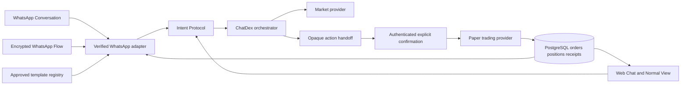

# ChatDex architecture

```mermaid
flowchart LR
  WA[WhatsApp Conversation] --> EDGE[Verified WhatsApp adapter]
  WF[Encrypted WhatsApp Flow] --> EDGE
  WEB[Web Chat and Normal View] --> INTENT[Intent Protocol]
  EDGE --> INTENT
  INTENT --> CORE[ChatDex orchestrator]
  CORE --> MARKET[Market provider]
  CORE --> HANDOFF[Opaque action handoff]
  HANDOFF --> CONFIRM[Authenticated explicit confirmation]
  CONFIRM --> PAPER[Paper trading provider]
  PAPER --> DB[(PostgreSQL orders positions receipts)]
  DB --> WEB
  DB --> EDGE
  TEMPLATE[Approved template registry] --> EDGE
```

Provider payloads terminate at adapters. PostgreSQL is authoritative for orders, positions, claims and receipts. WhatsApp identity alone never authorizes execution.
